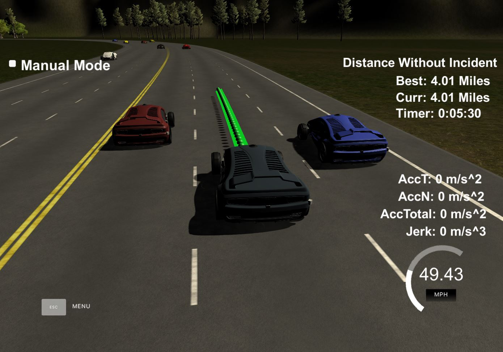
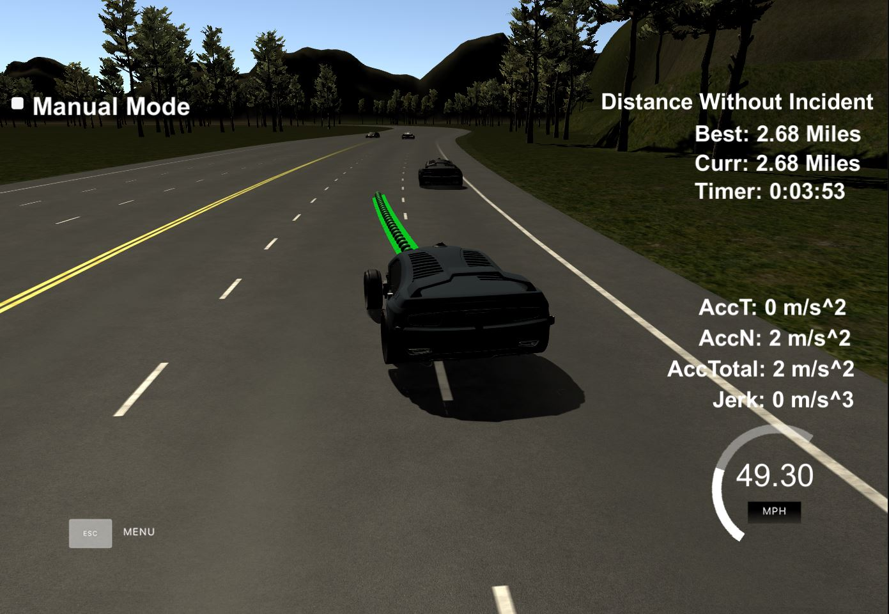
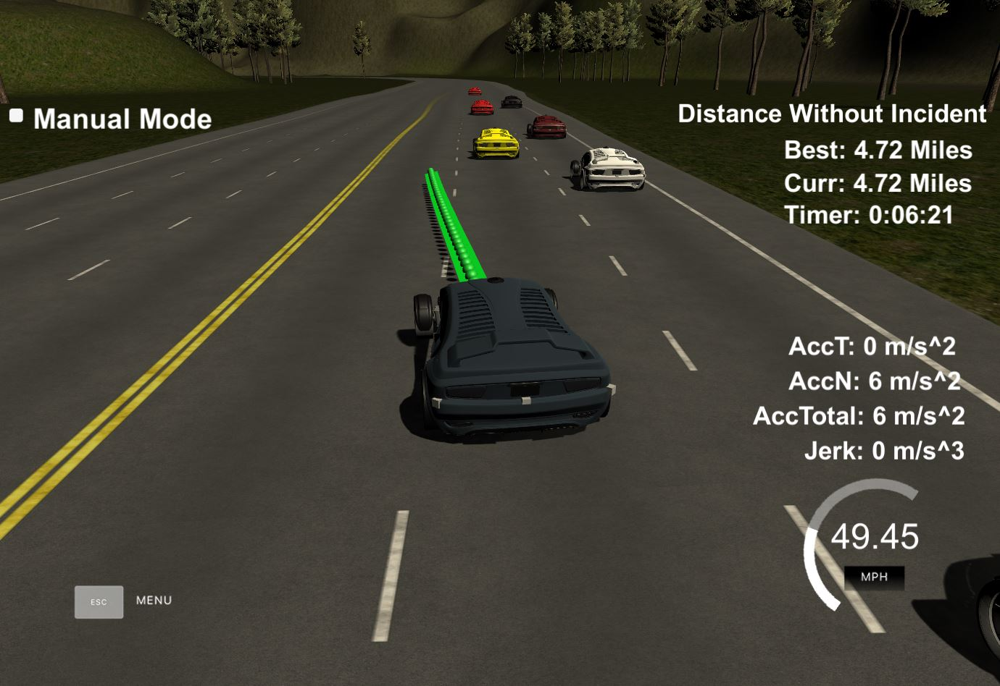
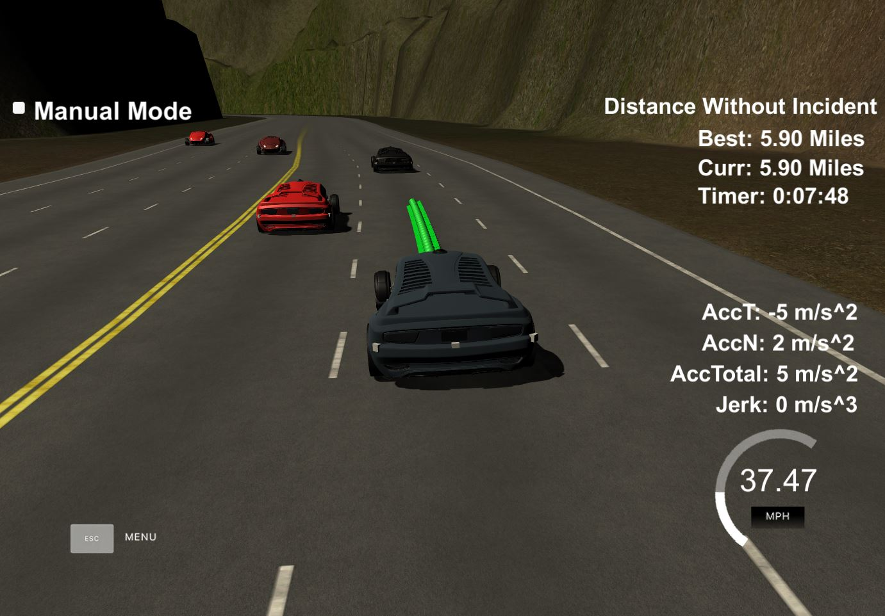

# CarND-Path-Planning-Project
Self-Driving Car Engineer Nanodegree Program



## Project Objective :
In this project the goal is to safely navigate around a virtual highway with other traffic that is driving +-10 MPH of the 50 MPH speed limit. The car's localization and sensor fusion data is provided by simulator. The car should try to go as close as possible to the 50 MPH speed limit, which means passing slower traffic when possible.The car should avoid hitting other cars at all cost as well as driving inside of the marked road lanes at all times, unless going from one lane to another. The car should be able to make one complete loop around the 6946m highway. Since the car is trying to go 50 MPH, it should take a little over 5 minutes to complete 1 loop. Also the car should not experience total acceleration over 10 m/s^2 and jerk that is greater than 10 m/s^3.

The following steps were followed to achieve project objectives : 
* Running vehicle at a constant speed (using x,y coordinates) 
* Running car at a center lane (using frenet coordinates)
* Smoothing the paths using previous path projections
* Using sensor fusion data to navigate lane changes and applying state transitions(following,lane change to left, lange change to right, lane change to center)


## Project description

### Ego vehicle : Initial State
The below are the inital conditions of the vehicle :
* lane =1
* Car Velocity = 0

The velocity of car is increased with time to so as to have steady increase in vehicle movement to avoid sudden acceleration and jerks.

### Ego Vehicle : State Transitions
The ego vehicle can be in any of the following states :
* Following : Ego vehicle is in this state if there is a vehicle in front of ego car and lane change is not possible due to vehicle in adjacent lane.
* Lane chane to left : Ego vehicle is in this state in case of overtaking a car in the current lane and checking of there is no vehicle present +-30meters on the left lane. 
* Lane change to right : Ego vehicle is in this state in case of overtaking a car in the current lane and checking of there is no vehicle present +-30meters on the right lane. 
* Lane change to center : Ego vehicle is in this state when there are no nearby vehicles. 

### Sensor Fusion data : For State Transitions
With sensor fusion data , information of the surrounding vehicle is used like lane,vehicle speed, S distance to determine if the surrounding vehicles are in (1) Ego vehicle lane (2) Left to the Ego vehicle lane (3) Right to the ego vehicle lane. With this information its finalised on which lane ego vehicle should be driving.

```
double vx = sensor_fusion[i][3];
double vy = sensor_fusion[i][4];
double check_speed = sqrt(vx*vx + vy*vy);
double check_car_s = sensor_fusion[i][5];
check_car_s += ((double)prev_size*0.02*check_speed);

```

### Lane Changes : Scenarios

The following images describes how the ego vehicle changed lane in different scenarios.

* Lane Change

     


* Following 
 

### Path Planning : Trajectories

The path trajectory is created by taking into account the previous waypoint so as to smoothen the path. Previous 2 waypoints are used to determine vehicle orientation(angle) and to estimate the forward path. The below code is used to make a path in forward direction. The current vehicle position is referenced as "0".

```
// Setting up target points in the future.
vector<double> next_wp0 = getXY(car_s + 30, 2 + 4*lane, map_waypoints_s, map_waypoints_x, map_waypoints_y);
vector<double> next_wp1 = getXY(car_s + 60, 2 + 4*lane, map_waypoints_s, map_waypoints_x, map_waypoints_y);
vector<double> next_wp2 = getXY(car_s + 90, 2 + 4*lane, map_waypoints_s, map_waypoints_x, map_waypoints_y);
```

The spline implementation is used to determine the y values for a given x values. 

```
// Create the spline.
tk::spline s;
s.set_points(ptsx, ptsy);

// Calculate distance y position on 30 m ahead.
double target_x = 30.0;
double target_y = s(target_x);
double target_dist = sqrt(target_x*target_x + target_y*target_y);

```


